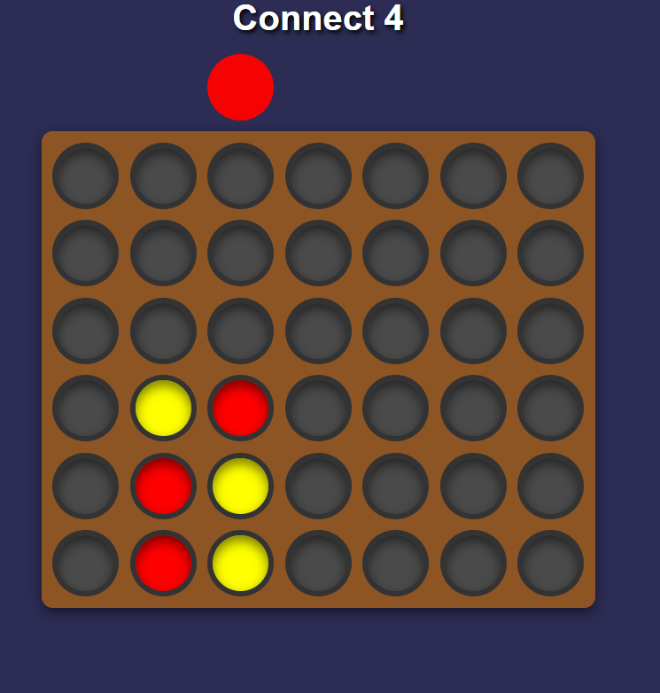

# Connect 4 Clone

A simple and interactive Connect 4 game built with **HTML**, **CSS**, and **JavaScript**. 🎮 
This project aims to strengthen my skills in vanilla web development by building a fun and challenging game!

Live Demo: [Connect 4 Clone](https://shubhamrawat090.github.io/ConnectFour/)

---

## 🕹️ Features

- **Two-Player Gameplay**: Compete against a friend on the same screen.
- **Interactive Design**: Visual feedback for player turns and game moves.
- **Responsive Layout**: Enjoy the game on desktop and mobile screens.
- **Dynamic Win Detection**: Detects horizontal, vertical, and diagonal wins.

---

## 🚀 How to Play

1. Open `index.html` in your browser.
2. Players take turns dropping their discs into the columns.
3. The first player to connect four discs in a row wins!
4. Press **Reset** to play again.

---

## 🛠️ Technologies Used

- **HTML5**: Structure and layout of the game board.
- **CSS3**: Styling and animations for an appealing UI.
- **JavaScript**: Game logic, player interactions, and win detection.

---

## 📸 Screenshot

**1. In-Game View**  


**2. Player 1's Turn**  


**3. Winner Screen**  


---

## 🔧 How to Run Locally

1. Clone this repository:
   ```bash
   git clone https://github.com/shubhamrawat090/ConnectFour.git
   ```
